# Architecture

This stack runs a **two-instance OpenClaw architecture** on one VPS:

- **🐯 Chloe (Worker)**: day-to-day assistant tasks (chat, browser automation, drafting)
- **🐕 Op (Guard)**: privileged control-plane (host control, secret broker, approvals)

## Design goals

- Keep user-facing automation fast and flexible (worker)
- Keep privileged access isolated and policy-gated (guard)
- Avoid exposing services publicly (Tailscale/SSH-first)
- Keep state persistent and reproducible via git + compose

## Components

- `${INSTANCE}-openclaw-gateway` (worker gateway, host port `18789`)
- `${INSTANCE}-openclaw-guard` (guard gateway, host port `18790` loopback)
- `${INSTANCE}-browser` (webtop + Chromium CDP + socat)

Default `INSTANCE` is `op-and-chloe`.
- `openclaw-cdp-watchdog.timer` (auto-recovery)
- Bitwarden CLI in guard for secret retrieval

## Trust boundaries

### 🐯 Chloe / Worker (unprivileged plane)

- Handles normal user workflows
- Has no dedicated break-glass path
- Must request privileged actions through guard policies

### 🐕 Op / Guard (privileged plane)

- Has access to:
  - `/var/run/docker.sock`
  - `/opt/openclaw-stack`
  - guard state/workspace
- Intended for approval-gated admin/secret operations only

## Diagram: component topology


## Diagram: approval flow (buttons-first)

```mermaid
sequenceDiagram
  participant U as User
  participant W as Worker
  participant G as Guard

  W->>G: request(action, reason, scope, ttl)
  G->>U: Telegram approval with inline buttons\n🚀 Approve / ❌ Deny
  U->>G: button callback
  alt Approved + valid actor/nonce/ttl
    G->>G: execute allowlisted action
    G-->>W: result + audit id
  else Denied/expired/invalid
    G-->>W: denied
  end
```



## Diagram: secret flow (Bitwarden)


## Operational commands

Run on VPS host:

```bash
sudo /opt/openclaw-stack/start.sh
sudo /opt/openclaw-stack/healthcheck.sh
sudo /opt/openclaw-stack/stop.sh
```

## Current security posture

- Worker break-glass scripts removed
- Guard is the only privileged instance
- Approval UX: inline buttons first, text fallback only
- Secrets should be managed via Bitwarden item retrieval in guard

## Known follow-ups

- Replace ad-hoc guard commands with strict allowlisted API surface
- Add immutable audit log for guard decisions/actions
- Move from CLI scripting to robust secret broker wrapper
