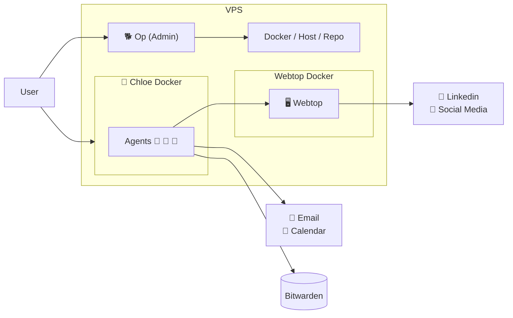

# op-and-chloe

<p align="center">
  
</p>

`op-and-chloe` ("openclaw-ey") is a two-instance OpenClaw stack for any VPS.

- **🐕 Op**: admin instance with SSH access — fix Chloe, restarts, large architectural changes
- **🐯 Chloe**: day-to-day instance — create all agents here; has Bitwarden, email, M365, webtop
- 🖥️ Webtop Chromium + CDP for shared browser (you + Chloe)
- 🔐 Passwordless: Bitwarden in Chloe; login/unlock interactive only, no secrets in files
- ❤️ Healthcheck + watchdog

> 🚀 Easiest setup ever: just run `sudo ./setup.sh` and you’re on your way! 🎉

## But why?

Why do you need this?  
Why not just use OpenClaw as it is?  

You can - and you should. OpenClaw is awesome.

Setting it up from start to finish can be very tedious, though. How do you securely share credentials? How do you give OpenClaw browser access - especially on a headless server? Should you use Browserless or run headless Chromium? If you can't see the browser, how do you log in? How do you troubleshoot or fix things from your phone? And how do you help someone set up OpenClaw if they're not comfortable with SSH or the command line?

I created `op-and-chloe` to make this process easier.  
It's not a framework, not a lock-in, **it's a simple wizard** to pre-configure your stack to get you started. **Once up and running, you can change it completely**.

It looks like this:

<p align="center">
  
</p>


**What you get out of the box:**

- **☁️ A working stack on any VPS.** I use [Hetzner](https://www.hetzner.com), it's **~$4.70/month** and runs the full stack really well - but you can use any VPS provider. See [HETZNER.md](./HETZNER.md).

- **📱 Two Telegram chats.** One for Op (admin, fixing Chloe, restarts); one for Chloe (day-to-day — create all agents here).

- **🔒 Private access via Tailscale.** Guard, worker, and Webtop are on your Tailscale network with optional HTTPS - no public ports. Use them from your phone or laptop.

- **❤️ Health Check.** Scripts to configure, verify and keep your stack healthy.

- **🔑 Passwordless credentials** Bitwarden runs in Chloe’s container. Login and unlock are interactive only; no secrets stored in files.


---


## Quick start

After purchasing your VPS from a provider, SSH into your server and follow the setup wizard step-by-step. No advanced technical skills required - just run each guided step **in order**. The wizard makes it easy: after each action, you’ll return to the menu so you can check your progress before moving on.

```bash
git clone https://github.com/mere/op-and-chloe.git
cd op-and-chloe
sudo ./setup.sh
```

<p align="center">
  
</p>
That's it!
It takes about 20 minutes to follow the steps and your `AI personal assistant` is ready! ✨

## How to update

To update your op-and-chloe stack: run `git pull`, then run the setup again. The wizard will show you if anything needs updating.

```bash
cd op-and-chloe   # or wherever you cloned the repo
git pull
sudo ./setup.sh
```

# Components

The stack consists of:
- **Three Docker containers:**
  - **🐕 Op**: admin instance with SSH access. For fixing Chloe, restarts, and large architectural changes.
  - **🐯 Chloe**: day-to-day instance. Create all agents here. Has Bitwarden, email (Himalaya, M365), and webtop.
  - **🖥️ Webtop**: shared browser for you and Chloe (co-working, automation).

---

<p align="center">
  
</p>

### 1. Chloe

**Chloe** *(claw-y)* is your first OpenClaw instance.  
(You can name her/him/they/it anything; it will ask for a name once it's up and running. 😊)

This is your day-to-day instance. Create all agents here. You get Bitwarden, email (Himalaya, M365), and webtop — standard OpenClaw; add skills and agents as you like.

When things break or you need restarts or big changes, talk to Op (admin with SSH access). Talk to Chloe for daily work.

---
<p align="center">
  
</p>

### 2. Op

**Op** is the admin instance with **SSH access**. Op’s job is to:
- fix Chloe when she breaks,
- do restarts, Docker, repo, and host changes,
- handle large architectural changes (whatever you’d otherwise SSH in to do).

You talk to Chloe for day-to-day work (create all agents there). You talk to Op when you need admin. 

---

<p align="center">
  
</p>

### 3. Browser access

On a Mac mini, you can easily give OpenClaw access to a browser. On a headless VPS that's harder: headless browsers or services like Browserless can be detected by some sites, and you can't easily *see* what the agent is doing. Ideally you want to **co-work**: you log in to LinkedIn, ask the agent to check messages and draft replies; the agent fills a form, you review and submit.

op-and-chloe gives you that: a small Docker image with a browser that both you and Chloe share. You log in once; Chloe uses the same session.

---
<p align="center">
  
</p>

### 4. Credentials

All secrets, tokens, and passwords are stored securely in Bitwarden — never on the server itself. During setup, you'll connect your Bitwarden vault to Chloe (worker) and unlock it interactively when needed; only the vault URL and session key are stored in worker state. Chloe uses the **`bw`** script to read from the vault for email setup, O365 config, and other tools. 


---
<p align="center">
  
</p>

## CLI Commands

Run the setup wizard:
```bash
sudo ./setup.sh
```

Is your AI about to take over the world? Stop the containers with:
```bash
sudo ./stop.sh
```

False alarm, it was just ordering cat food? Start it with:  
> Note: This also rebuilds the container, so it's a good way to reset if things go wrong!
```
sudo ./start.sh
```


Run full health check on the stack:
```bash
sudo ./healthcheck.sh
```

To run any `openclaw` command, use:
```bash
./openclaw-guard some command
# or
./openclaw-worker some command
```


## System diagram



## Architecture
See **Technical overview** in the Components section above.


## Bitwarden in Chloe

Chloe has **Bitwarden** in her container. She uses **`bw`** (e.g. `bw list items`, `bw get item <id>`) to read from the vault; session lives in worker state. One-time setup: scripts/worker/email-setup.py, scripts/worker/fetch-o365-config.py.

```bash
# In Chloe: Bitwarden runs locally
bw list items
bw get item <id>

# Email and M365 (after one-time setup)
himalaya envelope list -a icloud -s 20 -o json
m365 mail list --top 20
```

## Docs

- **OpenClaw Web (Control UI, bind modes, Tailscale):** [https://docs.openclaw.ai/web](https://docs.openclaw.ai/web)

## Troubleshooting

**`./openclaw-guard devices list` (or worker) shows "device token mismatch":**
- The container was started with an old gateway token. Recreate so they pick up the current env file: `sudo ./stop.sh && sudo ./start.sh` (wait ~90s for gateways to be ready, then try again).

**Dashboard URLs (Guard/Worker) return HTTP 502 after `stop.sh` / `start.sh`:**
- The gateways can take 60–90 seconds to start listening. `start.sh` now waits for them before applying Tailscale serve. If you still see 502, wait a minute and refresh, or re-run: `sudo ./scripts/host/apply-tailscale-serve.sh`

**Chloe's browser tool shows wrong URL or cdpReady: false:**
- The worker state must point at the browser container's CDP endpoint. On every `start.sh` we refresh it automatically. To fix immediately: `sudo ./scripts/host/update-webtop-cdp-url.sh` (then use the worker dashboard or reconnect so Chloe picks up the new config).

**Webtop URL (https://hostname:445/) not working:**
1. Ensure the browser container is running: `docker ps | grep browser`
2. Ensure Tailscale serve is configured: `tailscale serve status`  -  you should see port 445 → 127.0.0.1:6080
3. Re-apply serve config: `sudo ./scripts/host/apply-tailscale-serve.sh`
4. For HTTPS to work, enable [HTTPS certificates](https://tailscale.com/kb/1153/enabling-https) in the admin console and run `sudo tailscale cert` on the VPS

## Security model

- **No master password on disk:** In setup step 6 you log in and unlock once; only `BW_SERVER` and the session key are saved (worker state: `state/secrets/bitwarden.env`, `state/secrets/bw-session`). Chloe uses that session via **`bw`**; re-run step 6 if the vault is locked.
- Bitwarden runs in Chloe’s container; she has `bw` in PATH.

## License

This project is licensed under the [MIT License](LICENSE).

## Contributing

Contributions are welcome. See [CONTRIBUTING.md](CONTRIBUTING.md) for how to get started.
