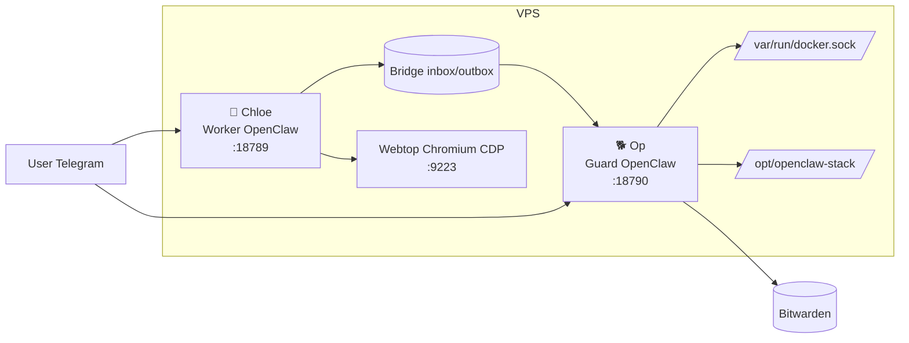
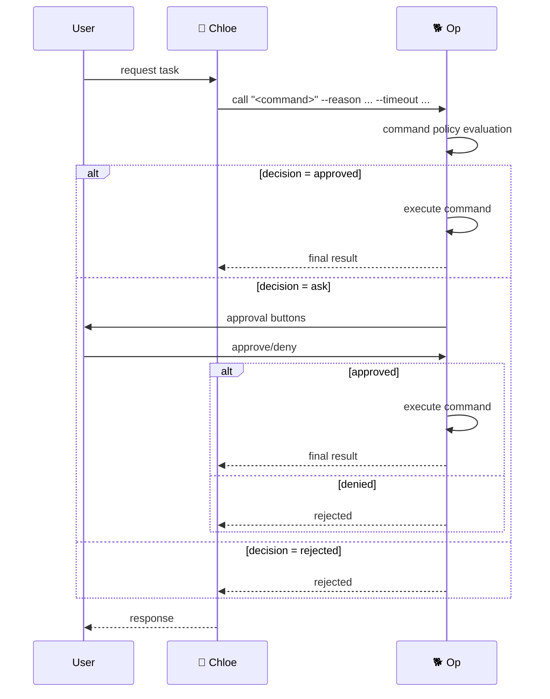

# op-and-chloe

`op-and-chloe` ("openclaw-ey") is a two-instance OpenClaw stack for any VPS.

- **🐯 Chloe**: friendly day-to-day assistant (safe container)
- **🐕 Op**: operator/guard instance (admin + security approvals)
- Webtop Chromium + CDP proxy for browser automation
- Healthcheck + watchdog

See architecture details in [ARCHITECTURE.md](./ARCHITECTURE.md).

## Quick start

```bash
git clone https://github.com/mere/openclaw-stack.git
cd openclaw-stack
sudo ./scripts/setup.sh
```

Use `Run ALL setup steps` in the setup wizard.

## Daily ops

```bash
sudo ./start.sh
sudo ./stop.sh
```

Optional explicit verification:

```bash
sudo ./healthcheck.sh
```

## System diagram



Approval flow (blocking call):




## Core instruction sync

Core instructions live in:

- `core/worker/*.md` (Chloe)
- `core/guard/*.md` (Op)

`scripts/sync-workspaces.sh` composes them into runtime workspaces:

- `/var/lib/openclaw/workspace`
- `/var/lib/openclaw/guard-workspace`

Managed files use two blocks:

- `<!-- CORE:BEGIN --> ... <!-- CORE:END -->` (repo-managed)
- `<!-- LOCAL:BEGIN --> ... <!-- LOCAL:END -->` (locally editable)

Core updates refresh automatically; local layer stays intact.

## Bridge model (blocking calls only)

Worker uses one bridge mode only: blocking `call`.

Examples:

```bash
call "git status --short" --reason "User asked for repo status" --timeout 30
call "himalaya envelope list -a icloud -s 20 -o json" --reason "User asked for inbox" --timeout 120
call "himalaya message read -a icloud 38400" --reason "User asked to read message" --timeout 120
call "cd /opt/openclaw-stack && git pull && ./start.sh" --reason "Update stack" --timeout 600
```

No action wrappers. Use direct commands through `command.run` policy.

## Security model

- Chloe has no direct password access.
- Credentialed operations are proxied via Op-approved commands.
- Bitwarden secrets are stored under `/var/lib/openclaw/guard-state/secrets/`.
- Prefer minimal, explicit command policy rules.
