# op-and-chloe

<p align="center">
  
</p>

`op-and-chloe` ("openclaw-ey") is a two-instance OpenClaw stack for any VPS.

- **🐯 Chloe**: friendly day-to-day assistant (safe container)
- **🐕 Op**: operator/guard instance (admin + security approvals)
- Webtop Chromium + CDP proxy for browser automation
- Healthcheck + watchdog

See architecture details in [ARCHITECTURE.md](./ARCHITECTURE.md).

## Quick start

```bash
git clone https://github.com/mere/op-and-chloe.git
cd op-and-chloe
sudo ./scripts/setup.sh
```

Use `Run ALL setup steps` in the setup wizard.

**Tailscale**: During setup you'll be prompted to log in. Use an [auth key](https://login.tailscale.com/admin/settings/keys) for headless VPS, or run `tailscale up` interactively.

**Tailscale HTTPS** (for Worker/Guard/Webtop dashboards): Enable [HTTPS certificates](https://tailscale.com/kb/1153/enabling-https) in the admin console, then run `sudo tailscale cert` on the VPS. The setup configures serve on ports 443 (Worker), 444 (Guard), 445 (Webtop).

## Daily ops

```bash
sudo ./start.sh
sudo ./stop.sh
```

Optional explicit verification:

```bash
sudo ./healthcheck.sh
```

## System diagram

```mermaid
flowchart TD
    CH("<b>🐯 Chloe Bot.</b><br/><br/>Responsible for<br/>day-to-day tasks<br/>No access to credentials.")
    OP("🐕 Operator Bot<br/>Responsible for security and authentication")
    U[🥰 User]
    BW[🔐 Bitwarden]
    BR[🖥️ Webtop Browser]

    U <-->|Approves tool use| OP
    U <-->|Chats via Telegram with| CH

    OP -->|Requests credentials from| BW
    OP -->|Oversees Chloe and provides authenticated tools| CH
    U -->|Logs in to web pages like Social Media sites| BR
    CH -->|Accesses| BR
    U -->|Sets secrets in| BW

    subgraph VPS
        CH
        BR
        OP
    end
```




## Core instruction sync

Core instructions live in:

- `core/worker/*.md` (Chloe)
- `core/guard/*.md` (Op)

`scripts/sync-workspaces.sh` composes them into runtime workspaces:

- `/var/lib/openclaw/workspace`
- `/var/lib/openclaw/guard-workspace`

Managed files use two blocks:

- `<!-- CORE:BEGIN --> ... <!-- CORE:END -->` (repo-managed)
- `<!-- LOCAL:BEGIN --> ... <!-- LOCAL:END -->` (locally editable)

Core updates refresh automatically; local layer stays intact.

## Bridge model (blocking calls only)

Worker uses one bridge mode only: blocking `call`.

Examples:

```bash
call "git status --short" --reason "User asked for repo status" --timeout 30
call "himalaya envelope list -a icloud -s 20 -o json" --reason "User asked for inbox" --timeout 120
call "himalaya message read -a icloud 38400" --reason "User asked to read message" --timeout 120
call "cd /opt/op-and-chloe && git pull && ./start.sh" --reason "Update stack" --timeout 600
```

No action wrappers. Use direct commands through `command.run` policy.

## Troubleshooting

**Webtop URL (https://hostname:445/) not working:**
1. Ensure the browser container is running: `docker ps | grep browser`
2. Ensure Tailscale serve is configured: `tailscale serve status` — you should see port 445 → 127.0.0.1:6080
3. Re-apply serve config: `sudo ./scripts/apply-tailscale-serve.sh`
4. For HTTPS to work, enable [HTTPS certificates](https://tailscale.com/kb/1153/enabling-https) in the admin console and run `sudo tailscale cert` on the VPS

## Security model

- Chloe has no direct password access.
- Credentialed operations are proxied via Op-approved commands.
- Bitwarden secrets are stored under `/var/lib/openclaw/guard-state/secrets/`.
- Bridge mount separation:
  - Chloe gets `/var/lib/openclaw/bridge` as read-only.
  - Chloe gets `/var/lib/openclaw/bridge/inbox` as the only writable bridge path.
  - Op keeps full bridge access for approvals, policy, and audit.
- Prefer minimal, explicit command policy rules.
