# op-and-chloe

<p align="center">
  
</p>

`op-and-chloe` ("openclaw-ey") is a two-instance OpenClaw stack for any VPS.

- **🐯 Chloe**: friendly day-to-day assistant (safe container)
- **🐕 Op**: operator/guard instance (admin + security approvals)
- 🖥️ Webtop Chromium + CDP proxy for browser automation
- 🔐 Safe credential storage with BitWarden
- ❤️ Healthcheck + watchdog

See architecture details in [ARCHITECTURE.md](./ARCHITECTURE.md).

## But Why?

Setting up a fully working and safe end-to-end OpenClaw stack is tedious—especially on a $5 VPS. This repo is a friendly wizard that guides you through an easy, opinionated setup. You can change everything once you're up and running.

You can set up op-and-chloe without any technical knowledge - you just need to follow the wizard's instructions step-by step.

By default it gives you:

- **☁️ A fully working setup on a VPS of your choice.** Our favourite is [Hetzner](https://www.hetzner.com), where you can run op-and-chloe for about **$4.70/month**. See [HETZNER.md](./HETZNER.md) for setup.

- **🖥️ A browser you can share with OpenClaw!** Log in to social sites (e.g. LinkedIn) in the Webtop browser and let OpenClaw use it to read messages and draft responses for you!

- **🔐 A safe split between Chloe and Op.** Chloe does day-to-day tasks without touching credentials; Op handles privileged operations and approvals so you stay in control.

- **📱 2 separate Telegram Chats.** You’ll get one chat for Chloe - this is where 99% of your conversations and commands will happen. The other chat is for Op, your personal security guard: it’s dedicated to approving requests and making changes to the stack, keeping privileged actions safe and separate.

- **🔒 Private access via Tailscale.** Worker, Guard, and Webtop dashboards are served over your Tailscale network with optional HTTPS—no public ports required. You can access them safely on your phone or on your laptop.

- **❤️ Healthcheck and watchdog.** Simple scripts to verify the stack and keep it running.

## Quick start

```bash
git clone https://github.com/mere/op-and-chloe.git
cd op-and-chloe
sudo ./scripts/setup.sh
```

Work through the setup steps 1–14 in order. Each step runs once and returns you to the menu so you can verify status before continuing.

<p align="center">
  
</p>


## Stopping and Starting your server
In case your openclaw stack gains consciousness and tries to take over the world,
you can quickly stop and start them using these commands:

```bash
sudo ./stop.sh
sudo ./start.sh
```

You can also run the healthcheck without the full wizard:

```bash
sudo ./healthcheck.sh
```

## System diagram

```mermaid
flowchart TD
    CH("<b>🐯 Chloe Bot.</b><br/><br/>Responsible for<br/>day-to-day tasks<br/>No access to credentials.")
    OP("🐕 Operator Bot<br/>Responsible for security and authentication")
    U[🥰 User]
    BW[🔐 Bitwarden]
    BR[🖥️ Webtop Browser]

    U <-->|Approves tool use| OP
    U <-->|Chats via Telegram with| CH

    OP -->|Requests credentials from| BW
    OP -->|Oversees Chloe and provides authenticated tools| CH
    U -->|Logs in to web pages like Social Media sites| BR
    CH -->|Accesses| BR
    U -->|Sets secrets in| BW

    subgraph VPS
        CH
        BR
        OP
    end
```




## Bridge model

Worker uses one bridge mode only: blocking `call`.

Examples:

```bash
call "git status --short" --reason "User asked for repo status" --timeout 30
call "himalaya envelope list -a icloud -s 20 -o json" --reason "User asked for inbox" --timeout 120
call "himalaya message read -a icloud 38400" --reason "User asked to read message" --timeout 120
call "cd /opt/op-and-chloe && git pull && ./start.sh" --reason "Update stack" --timeout 600
```

## Troubleshooting

**Webtop URL (https://hostname:445/) not working:**
1. Ensure the browser container is running: `docker ps | grep browser`
2. Ensure Tailscale serve is configured: `tailscale serve status` — you should see port 445 → 127.0.0.1:6080
3. Re-apply serve config: `sudo ./scripts/apply-tailscale-serve.sh`
4. For HTTPS to work, enable [HTTPS certificates](https://tailscale.com/kb/1153/enabling-https) in the admin console and run `sudo tailscale cert` on the VPS

## Security model

- Chloe has no direct password access.
- Credentialed operations are proxied via Op-approved commands.
- Bitwarden secrets are stored under `/var/lib/openclaw/guard-state/secrets/`.
- Bridge mount separation:
  - Chloe gets `/var/lib/openclaw/bridge` as read-only.
  - Chloe gets `/var/lib/openclaw/bridge/inbox` as the only writable bridge path.
  - Op keeps full bridge access for approvals, policy, and audit.
- Prefer minimal, explicit command policy rules.
