# op-and-chloe

<p align="center">
  
</p>

`op-and-chloe` ("openclaw-ey") is a two-instance OpenClaw stack for any VPS.

- **🐕 Op**: operator/guard instance (admin + security approvals)
- **🐯 Chloe**: friendly day-to-day assistant (safe container)
- 🖥️ Webtop Chromium + CDP proxy for browser automation
- 🔐 Safe credential storage with BitWarden
- ❤️ Healthcheck + watchdog

## But why?

Why do you need this?  
Why not just use OpenClaw as it is?  

You can - and you should. OpenClaw is awesome.

Setting it up from start to finish can be very tedious, though. How do you securely share credentials? How do you give OpenClaw browser access—especially on a headless server? Should you use Browserless or run headless Chromium? If you can't see the browser, how do you log in? How do you troubleshoot or fix things from your phone? And how do you help someone set up OpenClaw if they're not comfortable with SSH or the command line?

I created `op-and-chloe` to make this process easier.  
It's not a framework, not a lock-in, **it's a simple wizard** to pre-configure your stack to get you started. **Once up and running, you can change it completely**

It looks like this:

<p align="center">
  
</p>


**What you get out of the box:**

- **☁️ A working stack on any VPS.** I use [Hetzner](https://www.hetzner.com) it's **~$4.70/month** and runs the full stack really well. See [HETZNER.md](./HETZNER.md).

- **📱 Two Telegram chats.** One for Op (approvals, stack changes); one for Chloe (where most of your conversations happen).

- **🔒 Private access via Tailscale.** Guard, worker, and Webtop are on your Tailscale network with optional HTTPS—no public ports. Use them from your phone or laptop.

- **❤️ Health Check.** Scripts to configure, verify and keep your stack healthy.

- **🔑 Secure Credentials** pre-authenticated CLI bridge, so that Chloe, your worker openClaw instance has no access to any passwords.

## Quick start

```bash
git clone https://github.com/mere/op-and-chloe.git
cd op-and-chloe
sudo ./setup.sh
```

Work through the setup steps 1–16 in order. No deep technical knowledge needed—just follow the wizard; each step runs once and returns you to the menu so you can verify before continuing.


# Components

<p align="center">
  
</p>

### 1. Chloe

**Chloe** *(claw-y)* is your first OpenClaw instance.  
(You can name her/him/they/it anything; it will ask for a name once it's up and running. 😊)

This is your main AI you'll be chatting with every day. Your personal assistant, trainer, coach, friend, AI employee - configure it in any way you like, even set up multiple agents.  
On the tech side, it's a standard OpenClaw installation: you can add/install/tweak/configure anything you like. Install all those funky skills, get messy! It's the OpenClaw you know and love.

But things can - and will break. Configs drift, cryptic errors appear, and some fixes can't be done in a Telegram chat. You'd have to SSH in and fix things by hand. There's also security: do you want this volatile instance to hold all your credentials? What if you install something sketchy?

This is where Op comes in:

---
<p align="center">
  
</p>

## Op

**Op** is a small OpenClaw instance designed to stay clean and minimal. No skills, no cron jobs, no day-to-day tasks, no custom installs. Its job is to:
- fix things when they go wrong,
- oversee Chloe and 
- proxy pre-authenticated tools to her so she never gets to see your passwords.
- ask for your approval when Chloe tries to use a new pre-authenticated command, eg. *delete an email*.

Think of Op as your DevOps friend who can fix everything for you - including fully reconfiguring, resetting or reinstalling Chloe if needed. 

---

<p align="center">
  
</p>

### Browser access

On a Mac mini, you can easily give OpenClaw access to a browser. On a headless VPS that's harder: headless browsers or services like Browserless can be detected by some sites, and you can't easily *see* what the agent is doing. Ideally you want to **co-work**: you log in to LinkedIn, ask the agent to check messages and draft replies; the agent fills a form, you review and submit.

op-and-chloe gives you that: a small Docker image with a browser that both you and Chloe share. You log in once; Chloe uses the same session.

---
<p align="center">
  
</p>

### Credentials

The setup script can help you create a free Bitwarden account and share it with Op. Keep your secrets, tokens, and passwords there. When Chloe needs authenticated tools (mail, calendar, etc.), she requests them over an internal bridge where they're **pre-authenticated**—she never sees the secrets.

---
<p align="center">
  
</p>

## CLI Commands

Run the setup wizard:
```bash
sudo ./setup.sh
```

Stop and start (also rebuild) the docker images:
```bash
sudo ./stop.sh
sudo ./start.sh
```
`start.sh` syncs the latest **core instructions** (Op and Chloe role text from `core/guard/` and `core/worker/`) into the workspaces at startup, so after a `git pull` a normal `./start.sh` gives you the latest behaviour.

**Re-sync instructions without restarting:**  
In the setup wizard, use step **15. seed instructions** to copy the latest `core/guard` and `core/worker` role text into the workspaces. You can also run:
```bash
sudo ./scripts/sync-workspaces.sh
```
The workspaces are bind-mounted, so guard and worker see the updated files on next use.

You can also run the healthcheck without the full wizard:

```bash
sudo ./healthcheck.sh
```

## System diagram

```mermaid
flowchart TD
    CH("<b>🐯 Chloe Bot.</b><br/><br/>Responsible for<br/>day-to-day tasks<br/>No access to credentials.")
    OP("🐕 Operator Bot<br/>Responsible for security and authentication")
    U[🥰 User]
    BW[🔐 Bitwarden]
    BR[🖥️ Webtop Browser]

    U <-->|Approves tool use| OP
    U <-->|Chats via Telegram with| CH

    OP -->|Requests credentials from| BW
    OP -->|Oversees Chloe and provides authenticated tools| CH
    U -->|Logs in to web pages like Social Media sites| BR
    CH -->|Accesses| BR
    U -->|Sets secrets in| BW

    subgraph VPS
        CH
        BR
        OP
    end
```



## Architecture
See architecture details in [ARCHITECTURE.md](./ARCHITECTURE.md).


## Bridge model

Worker uses a bridge to get pre-authenticated commands, eg.:

Examples:

```bash
call "git status --short" --reason "User asked for repo status" --timeout 30
call "himalaya envelope list -a icloud -s 20 -o json" --reason "User asked for inbox" --timeout 120
call "himalaya message read -a icloud 38400" --reason "User asked to read message" --timeout 120
call "cd /opt/op-and-chloe && git pull && ./start.sh" --reason "Update stack" --timeout 600
```

## Docs

- **OpenClaw Web (Control UI, bind modes, Tailscale):** [https://docs.openclaw.ai/web](https://docs.openclaw.ai/web)

## Troubleshooting

**`./openclaw-guard devices list` (or worker) shows "device token mismatch":**
- The container was started with an old gateway token. Recreate so they pick up the current env file: `sudo ./stop.sh && sudo ./start.sh` (wait ~90s for gateways to be ready, then try again).

**Dashboard URLs (Guard/Worker) return HTTP 502 after `stop.sh` / `start.sh`:**
- The gateways can take 60–90 seconds to start listening. `start.sh` now waits for them before applying Tailscale serve. If you still see 502, wait a minute and refresh, or re-run: `sudo ./scripts/apply-tailscale-serve.sh`

**Webtop URL (https://hostname:445/) not working:**
1. Ensure the browser container is running: `docker ps | grep browser`
2. Ensure Tailscale serve is configured: `tailscale serve status` — you should see port 445 → 127.0.0.1:6080
3. Re-apply serve config: `sudo ./scripts/apply-tailscale-serve.sh`
4. For HTTPS to work, enable [HTTPS certificates](https://tailscale.com/kb/1153/enabling-https) in the admin console and run `sudo tailscale cert` on the VPS

## Security model

- Chloe has no direct password access.
- Credentialed operations are proxied via Op-approved commands.
- Bitwarden secrets are stored under `/var/lib/openclaw/guard-state/secrets/`.
- Bridge mount separation:
  - Chloe gets `/var/lib/openclaw/bridge` as read-only.
  - Chloe gets `/var/lib/openclaw/bridge/inbox` as the only writable bridge path.
  - Op keeps full bridge access for approvals, policy, and audit.
- Prefer minimal, explicit command policy rules.
